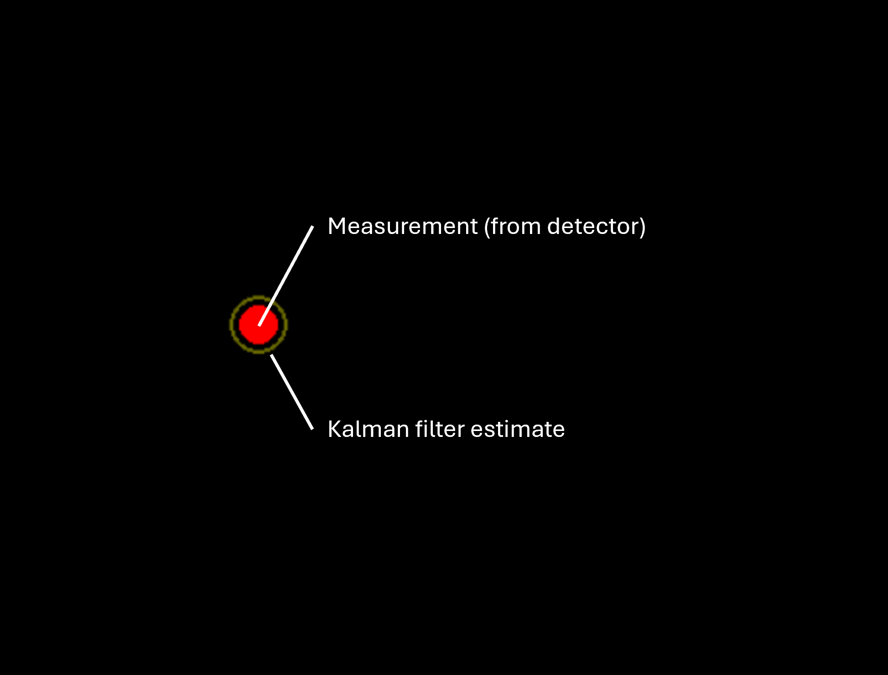
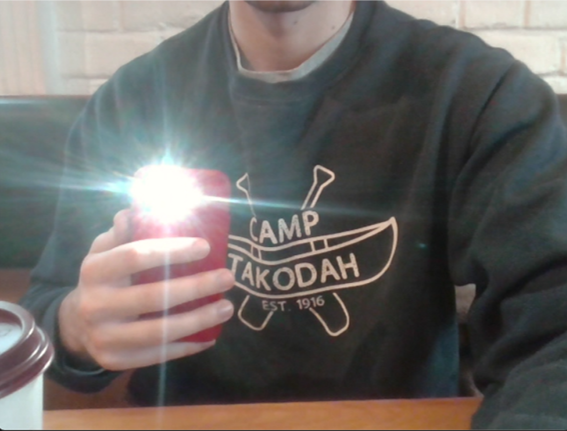
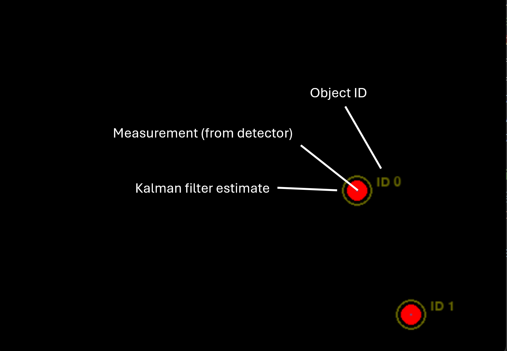

# Naive-Predictor-to-Kalman-Filter

## Overview
This project explores how a 2D grid-based world can be rendered as a 3D first-person view
using raycasting techniques inspired by early games like DOOM.

The project started as a simple marching-step raycaster and was later upgraded
to a DDA-based approach to remove fisheye distortion and improve accuracy.

---

## Preview (Version 2 – DDA Raycasting)

| Measurement vs Kalman Filter Estimate | Raw Camera Image |
|-------------------------------------|------------------|
|  |  |
---

## Preview (Version 2 – DDA Raycasting)

| Multi-Object Kalman Tracker (Const. Acceleration Model) | Raw Camera Image |
|-------------------------------------|------------------|
|  |  |
---

## Project Evolution
